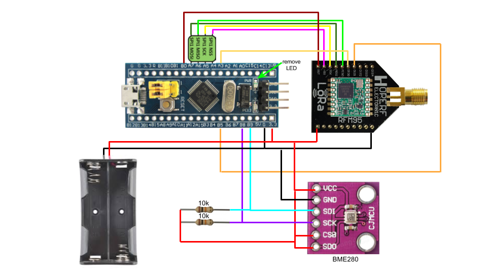
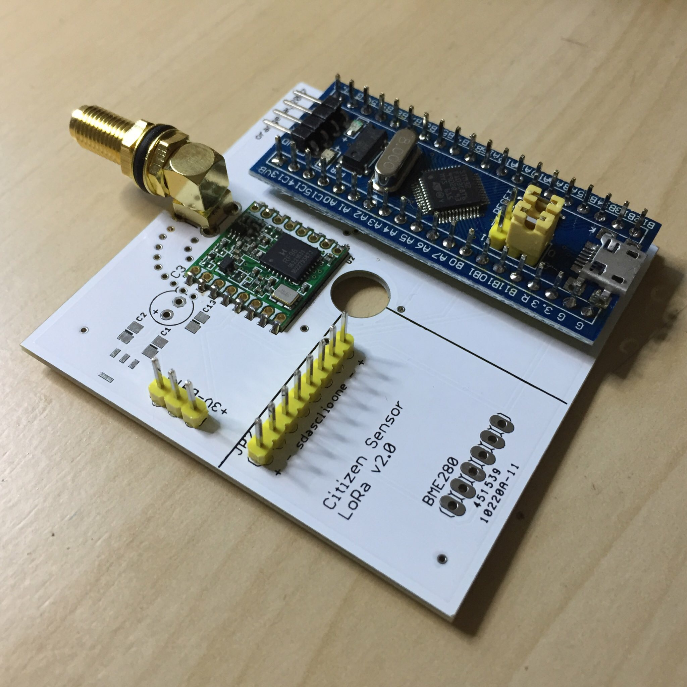
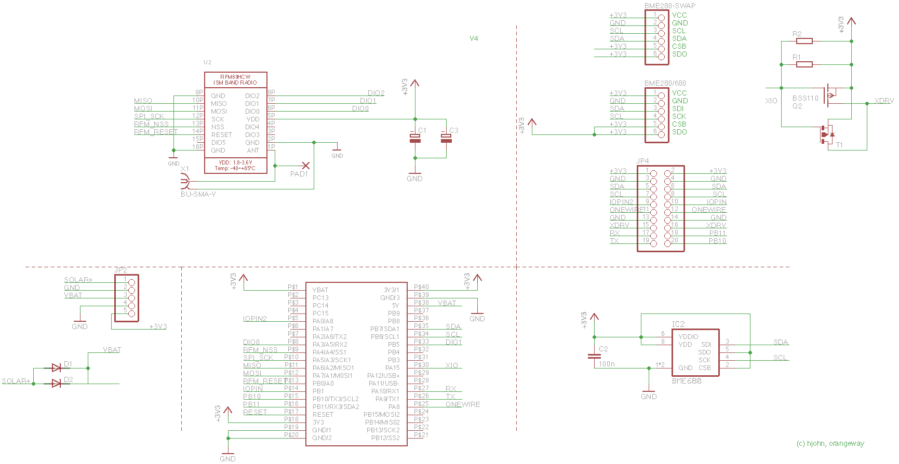
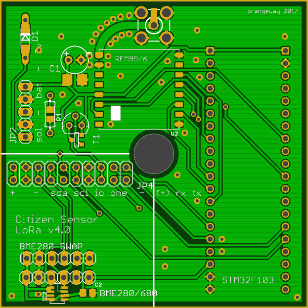

# CitizenSensor
A low budget battery powered LoRa node to smart up your city

    

## bill of materials
| Parts List for boxed version              |
|-------------------------------------------|
| STM32F103C8T6 Minimum System Dev Board    |
| RFM95 868Mhz Modul                        |
| RFM95 Adapter (only for Breadboard)       |
| SMA PCB Connector female                  |
| Antenna SMA male 868mhz 2dbi              |
| BME 280 Breakout 6pin 3.3v only w/ pullup |
| 2x 10k resistor                           |
| Battery Holder 2xAA                       |
| Header 2.54mm 12pin                       |
| Abzweigdose IP54 grau Aufputz 75x75x40 mm |
| CitizenSensor V4.0 PCB                    |

## Prototyp

    

## Schematic PCB V4.0

    

## PCB V4.0 top

    

